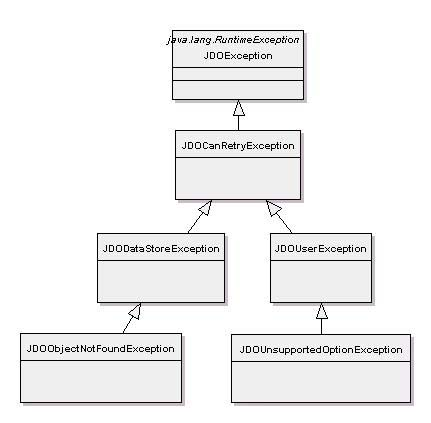
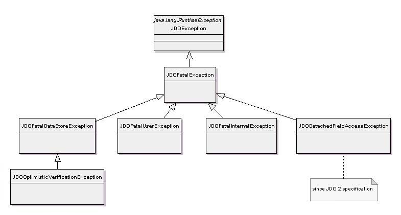

[[index]]
{empty} +

:_basedir: 
:_imagesdir: images/
:notoc:
:nofooter:
:titlepage:
:grid: cols

== JDO Exceptionsanchor:JDO_Exceptions[]

All exceptions raised by a JDO implementation are runtime exceptions
which means that you can choose to catch the exceptions or not. The
reason for JDO using _unchecked_ exceptions is that JDO tries to provide
transparent persistence, and so needs to present the same interface and
exceptions whatever the state an object has.

=== JDOExceptionanchor:JDOException[]

This is the base class for all JDO exceptions. It is a subclass of
RuntimeException, and need not be declared or caught.

{empty} +

=== Can Retry Exceptionsanchor:Can_Retry_Exceptions[]

[cols=",",options="header",]
|===
|Exception |Description
|JDOCanRetryException |This is the base class for errors that can be
retried.

|JDOUserException |This is the base class for user errors that can be
retried.

|JDODataStoreException |This is the base class for datastore errors that
can be retried. Any root SQLException that caused this will typically be
nested within this exception.

|JDOObjectNotFoundException |This exception is to notify the application
that an object does not exist in the datastore. When this exception is
thrown during a transaction, there has been no change in the status of
the transaction in progress. If this exception is a nested exception
thrown during commit, then the transaction is rolled back.

|JDOUnsupportedOptionException |This exception is thrown by an
implementation to indicate that it does not implement a JDO optional
feature.
|===

{empty} +

=== Fatal Exceptionsanchor:Fatal_Exceptions[]

[cols=",",options="header",]
|===
|Exception |Description
|JDOFatalException |This is the base class for errors that cannot be
retried. This exception generally means that the transaction associated
with the PersistenceManager has been rolled back, and the transaction
should be abandoned.

|JDOFatalUserException |This is the base class for user errors that
cannot be retried.

|JDOFatalInternalException |This is the base class for JDO
implementation failures.

|JDOFatalDataStoreException |This is the base class for fatal datastore
errors. When this exception is thrown, the transaction has been rolled
back. Any root SQLException that caused this will typically be nested
within this exception.

|JDOOptimisticVerificationException |This exception is the result of a
user commit operation in an optimistic transaction where the
verification of new, modified, or deleted instances fails the
verification. The user will never see this exception except as a result
of commit.

|JDODetachedFieldAccessException |This exception is the result of a user
accessing a field of a detached instance, where the field was not copied
to the detached instance.
|===

