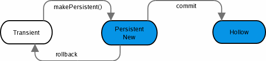
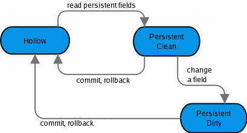
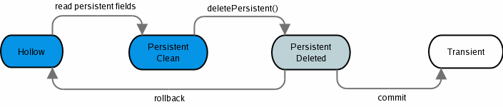
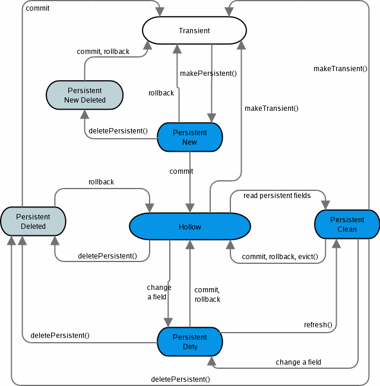

:_basedir: 
:_imagesdir: images/
:grid: cols
:usage:

[[index]]

== JDO State Transitionanchor:JDO_State_Transition[]

JDO manages the lifecycle of an object, from creation (*Transient*)
through to persistence in the datastore (*Hollow*, *Persistent Clean*)
and all of the various states between these. The transition between
these states are achieved by using methods on the Persistence Manager
such as _makePersistent()_, _makeTransient()_, _deletePersistent()_, and
by commiting the changes made by these operations, or by rolling them
back.

The various lifecycle states supported by JDO are shown below.

[cols=",",options="header",]
|===
|Name |Description
|Transient |Any object created by the developer that do are not
persisted. These don't have a JDO identity.

|Persistent New |Any object that is newly persisted in the current
transaction. A JDO identity has been assigned to these objects.

|Persistent Dirty |Any persistent object that has been changed in the
current transaction.

|Hollow |Any persistent object that represents data in the datastore,
but whose values are not in the instance.

|Persistent Clean |Any persistent object that represents data in the
datastore, and whose values have not been changed in the current
transaction.

|Persistent Deleted |Any persistent object that represents data in the
datastore, and that has been deleted in the current transaction.

|Persistent New Deleted |Any object that have been newly made persistent
and then deleted in the same current transaction.

|Persistent Non transactional |Any persistent object that represents
data in the datastore, whose values are loaded but not transactionally
consistent.

|Persistent Non transactional Dirty |Any persistent object that
represents data in the datastore, whose values are loaded but not
transactionally consistent, and that has been modified.

|Transient Clean |Any transient object that represents a transactional
instance whose values have not been changed in the current transaction.

|Transient Dirty |Any transient object that represents a transactional
instance whose values have been changed in the current transaction.

|Detached Clean |Any detached object that represents a persistent
instance whose values have not been changed since detaching.

|Detached Dirty |Any detached object that represents a persistent
instance whose values have been changed since detaching.
|===

=== Detecting Object Stateanchor:Detecting_Object_State[]

JDO provides a class xref:jdohelper.adoc[JDOHelper] that allows you to
interrogate the object state via its attributes (isPersistent(),
isDeleted(), etc). In JDO 2.1 for JDKs 1.5+ _JDOHelper_ is extended to
also provide a method that gives the full object state.

....
ObjectState state = JDOHelper.getObjectState(obj);
....

{empty} +

=== Persisting an objectanchor:Persisting_an_object[]

The most basic thing you can do with JDO is persist an object. The
following code is an example of how you can do this

....
Transaction tx=pm.currentTransaction();
try
{
    tx.begin();
    Product product = new Product("Plate", 9.99);
    pm.makePersistent(product);
    tx.commit();
}
finally
{
    if (tx.isActive())
    {
        tx.rollback();
    }
}
                
....

The _Product_ object progresses from *Transient* (initial, unpersisted
state), through to *Persistent New*, and then finally to *Hollow* when
it reaches the data store (after the "commit"). If the persist failed,
it would "rollback" and hence end up in the same state as when it
started. The following diagram shows this graphically

{empty} +

 +

=== Updating an objectanchor:Updating_an_object[]

When you have persisted objects you need to update them. The following
code is an example of how you can do this

....
Transaction tx=pm.currentTransaction();
try
{
    tx.begin();
    String product_name = product.getName();
    ...
    product.setPrice(7.50);
    tx.commit();
}
finally
{
    if (tx.isActive())
    {
        tx.rollback();
    }
}
                
....

The _Product_ object starts off in *Hollow* state and progresses to
*Persistent Clean* when the user requires to read from it. It then
migrates to *Persistent Dirty* when the price is updated. Finally it
returns to *Hollow* when the user commits/rolls back the transaction.
The following diagram shows this graphically

{empty} +

 +

=== Deleting an objectanchor:Deleting_an_object[]

When you no longer need an object persisted, you can delete it. The
following code is an example of how you can do this

....
Transaction tx=pm.currentTransaction();
try
{
    tx.begin();
    String product_name = product.getName();
    ...
    pm.deletePersistent(product);
    tx.commit();
}
finally
{
    if (tx.isActive())
    {
        tx.rollback();
    }
}
                
....

The _Product_ object starts off in *Hollow* state and progresses to
*Persistent Clean* when the user requires to read from it. It then
migrates to *Persistent Deleted* when the deletePersistent() called.
Finally it either progresses to *Transient* when commit is called, or
returns to *Hollow* if it is rolled back. The following diagram shows
this graphically

{empty} +

 +

=== Possible state transitionsanchor:Possible_state_transitions[]

The following diagram shows the state transitions possible with JDO.

{empty} +

 +

